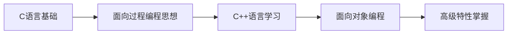

# 如何学以及如何学好C++语言？

## 🎯 学习路径建议

以作者自己的经验来看，即便您将来打算从事C++方向的开发，也建议没有编程基础的同学先从C语言开始学习，掌握C语言及面向过程的编程思想，接着再学习具有一脉相承的C++语言，不仅可以科学地学习两门计算机界最主流的开发语言，更可以体会到软件开发思想发展的变化，起到触类旁通的效果。

### 📚 学习顺序

## 🛠️ 关于这套C++教程的学习方法

### 📋 学习要求

这套教程需要您具备基本的C语言语法知识，并且循序渐进地学习和理解。作为一套重视动手实践的C++教程，我们在讲解知识点时，更多采用通俗易懂的语言和样例代码进行展示，并且每个重要知识点都有完整的例子程序。

### 💻 实践建议

我们希望读者可以边学边上机实现，来验证例子程序的结果，因为并不是所有的系统、编译器结果都完全一样，我们也极力建议您亲自上机运行来确认。

### 📝 作业系统

除此以外，我们在课后安排了习题作业，在网站对应的题库中，需要大家完成提交并通过评测，才可以继续后面的学习。以此来保证大家的学练同步，强化动手能力，真正做到学会C++、会写C++！

## 🎯 学习目标

通过系统学习，您将能够：

- ✅ 掌握C++基础语法和面向对象编程思想
- ✅ 理解C语言到C++的演进过程
- ✅ 具备独立编写C++程序的能力
- ✅ 为后续深入学习打下坚实基础

## 💡 学习技巧

| 技巧 | 说明 | 重要性 |
|------|------|--------|
| **理论结合实践** | 每学一个概念都要动手编程验证 | ⭐⭐⭐⭐⭐ |
| **循序渐进** | 不要跳跃式学习，打好基础 | ⭐⭐⭐⭐⭐ |
| **举一反三** | 尝试修改示例代码，加深理解 | ⭐⭐⭐⭐ |
| **及时复习** | 定期回顾之前学过的内容 | ⭐⭐⭐⭐ |
| **项目驱动** | 通过小项目巩固所学知识 | ⭐⭐⭐ |

---

> 🎉 **最后，祝您学有所成！** 记住，编程是一门实践性很强的技能，多动手、多思考、多总结，相信您一定能够掌握C++这门强大的编程语言！